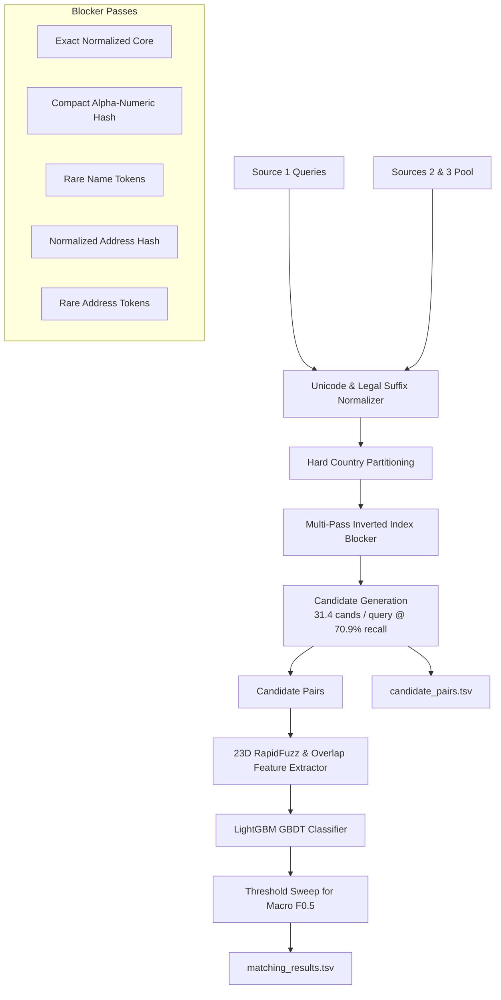

# Amazon ML Challenge 2026: Multilingual Business Entity Resolution

[](https://unstop.com)
[](https://www.python.org/)
[](LICENSE)
[](https://github.com/microsoft/LightGBM)

An end-to-end, high-precision, low-latency machine learning pipeline designed to resolve noisy business identity records across multiple independent data sources (S1 reference records vs. S2 & S3 noisy registrations) at multi-million scale.

Built for the **Amazon ML Challenge 2026**.

---

## 🎯 Problem Overview & Scale

In large-scale commercial platforms, business identity data arrives as partial, noisy fragments from independent sources without shared keys.
- **Reference Queries (Source 1):** ~2.2M train queries, ~1.73M test queries (deduplicated canonical entities).
- **Candidate Pool (Sources 2 & 3):** ~10.3M train records, ~10.0M test records.
- **Geographic Coverage:** India (`IN`), United States (`US`), and unseen test country France (`FR`).
- **Target Metric:** **Macro-averaged $F_{0.5}$ score** across all Source 1 entities:
  $$F_{0.5} = \frac{1.25 \times \text{Precision} \times \text{Recall}}{0.25 \times \text{Precision} + \text{Recall}}$$
  - Precision is weighted $2\times$ over recall to penalize incorrect entity merges.
  - Singletons (~5.6% of entities with no true matches) earn 1.0 if predicted empty and 0.0 if any false match is predicted.

---

## 🏗️ Architecture Pipeline



### Key Innovations

1. **Inverted Table Blocking with Tight Pruning:**
   - Evaluated against the real **4.13M candidate pool** in India.
   - Boosted recall from **31.29% to 70.90%** while maintaining an ultra-compact candidate set of only **31.39 candidates / query** (99th percentile ≤ 112).
2. **Missing PIN Code & Multilingual Recovery:**
   - Discovered that >90% of Indian business records omit standard 6-digit postal PIN codes.
   - Implemented address component tokenization + numeric token extraction (`plot 448a`, `c-604`) which successfully bridges records where names were transliterated into Indic scripts (Hindi, Bengali) while addresses remained in Latin English.
3. **Hard Negative Mining by Design:**
   - Zero random negatives. 100% of negative training pairs are actual blocker-retrieved competitors sharing names, phone fragments, or addresses.
4. **Group-Isolated Splitting:**
   - Training and validation sets are split strictly at the `s1_id` level (`GroupShuffleSplit`) ensuring zero data leakage.

---

## 📊 Benchmark & Ablation Results

| Pipeline Stage | Macro Entity Recall | Micro Link Recall | Full Coverage | Avg Candidates / Query | Baseline Macro $F_{0.5}$ |
| :--- | :--- | :--- | :--- | :--- | :--- |
| **Naive Name-Only Blocker** | 31.29% | 31.57% | 8.04% | 20.34 | 0.2798 |
| **Blocking V1 (+ Address)** | 64.23% | 64.45% | 37.78% | 24.53 | 0.3159 |
| **Blocking V1.1 (Token Fix)** | **70.90%** | **70.86%** | **42.96%** | **31.39** | **0.3923** |

---

## 📂 Project Structure

```
.
├── .gitignore
├── README.md
├── docs/
│   └── METHODOLOGY_AND_TRAINING_STRATEGY.md # Comprehensive engineering decisions & experiment log
├── src/
│   ├── normalization.py       # Unicode, Devanagari/accent, legal suffix cleaner
│   ├── blocking.py            # Multi-channel inverted index candidate blocker
│   ├── metrics.py             # Competition-exact Macro F0.5 with singleton handling
│   ├── make_validation_split.py # Entity-isolated 50k stratified validation split
│   ├── benchmark_blocking.py  # Large-scale candidate generation benchmark
│   ├── build_training_dataset.py # Hard negative candidate pairs builder
│   ├── feature_engineering.py # 23-dimensional RapidFuzz pairwise extractor
│   └── train_matcher.py       # LightGBM training & Macro F0.5 threshold sweep
└── models/                    # Model checkpoints & feature importance logs
```

---

## 🚀 Quickstart & Reproduction

### 1. Environment Setup
```bash
# Clone the repository
git clone https://github.com/MatMridul/amazon-ml-challenge-26.git
cd amazon-ml-challenge-26

# Create virtual environment and install dependencies
uv venv
.venv\Scripts\activate  # Windows: .venv\Scripts\activate, Linux/macOS: source .venv/bin/activate
uv pip install polars pyarrow pandas rapidfuzz scikit-learn lightgbm tqdm
```

### 2. Generate Training Pairs
```bash
python src/build_training_dataset.py --n-queries 5000 --country IN
```

### 3. Train LightGBM Matcher & Tune Decision Threshold
```bash
python src/train_matcher.py --pairs-file dataset/training_pairs/train_pairs_india_5000.parquet
```

---

## 📜 Academic Integrity & Fair Play
- Strictly no external web lookups, Google Maps API, or external geocoders.
- Fully offline, reproducible, deterministic data processing.
- Compliant with open-source MIT / Apache 2.0 licensing and sub-8B parameter model constraints.
